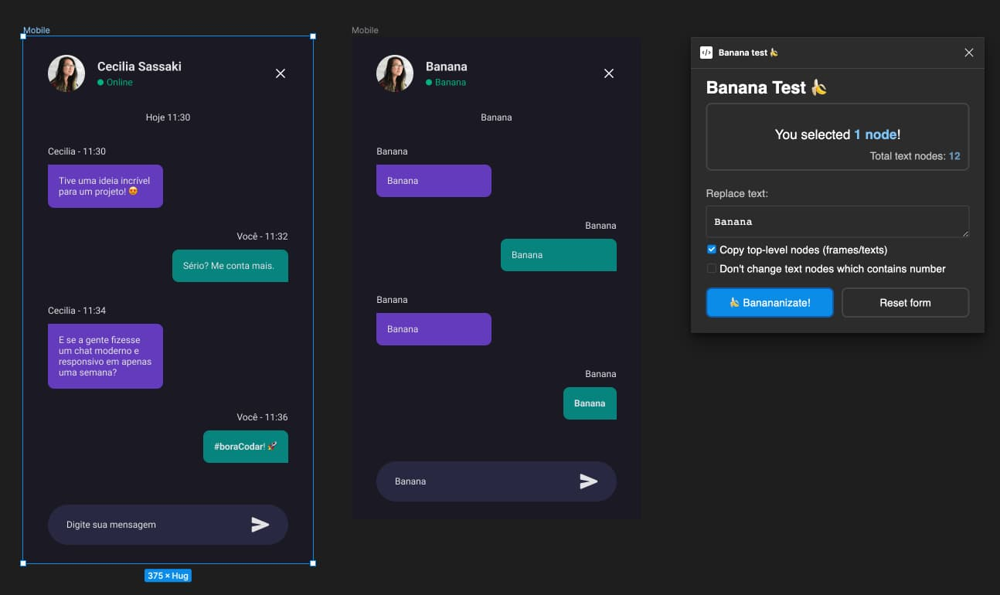

# Banana Test 🍌

__Test your interfaces to UX using "Banana-test" in [Figma][figma] so easy!__

[][url]

## Idea of plugin:

When you are testing the layout of some page where the user has to perform an action, 
try replacing all the texts with the word "Banana" or some nonsense like this. 
And then with this "sanitized" layout, you need to do corridor testing. 
And even if it is clear to all users what each interface element means, 
then this is a good interface! This means that you can easily connect other languages to your site, 
and even in case of a translation error in the interface text, 
the user will still be able to complete his task.

Of course, it makes no sense to conduct such tests on information blogs. 
But for some online store, this is quite a good way to check that the "Buy" button will be pressed, 
even if the fonts fall off.

## Features:

This plugin can:

- Replace all text in selected nodes to "Banana" or anything else
- Clone selected nodes and replace text in this new nodes. It's more safely!

## How to use?

1. Run ["Banana Test"][url] plugin in Figma file.
2. Select nodes, which you want to test.
3. Click `Banananizate 🍌` button.
4. _And "Voila!)"_ You have a lot of bananas!)

## Contacts:

- Email: me@jagk.ru
- Plugin Homepage: [Figma Community][url]
- Repository: [GitHub](https://github.com/jag-k/figma-plugin-bananatest)
- My GitHub: [@jag-k](https://github.com/jag-k)

[figma]: https://figma.com/
[url]: https://www.figma.com/community/plugin/1201931496477245125
